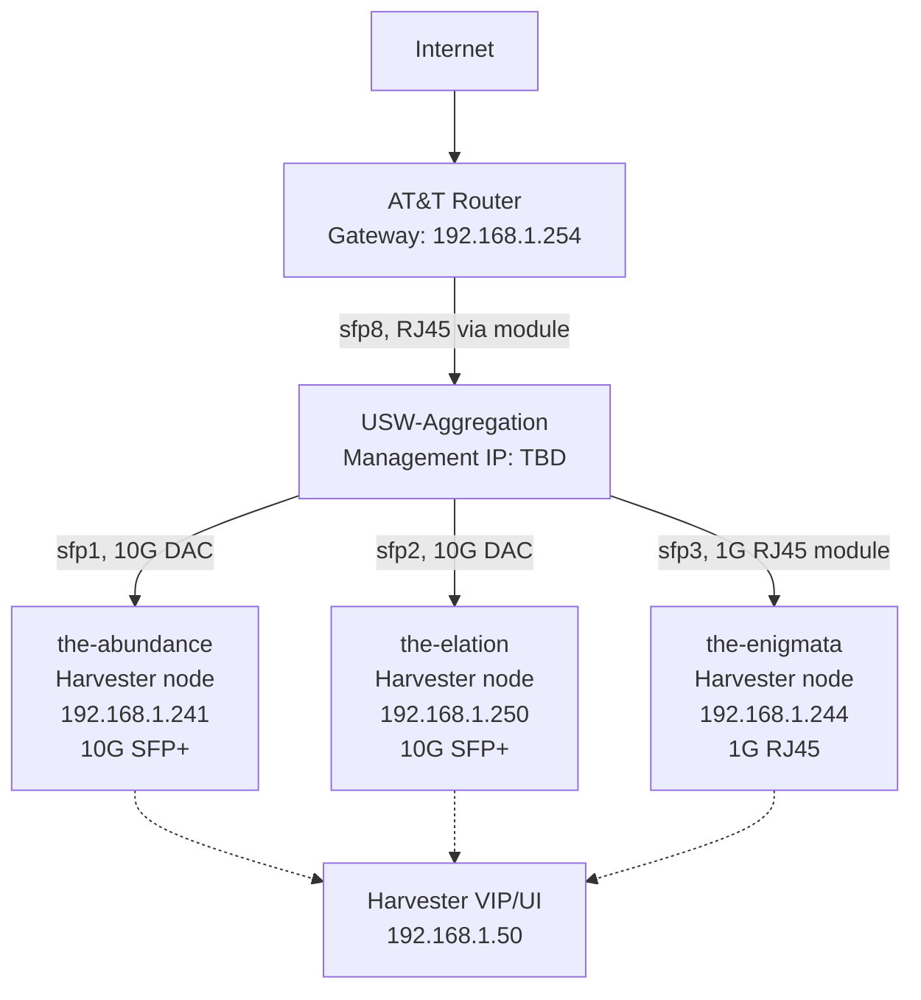
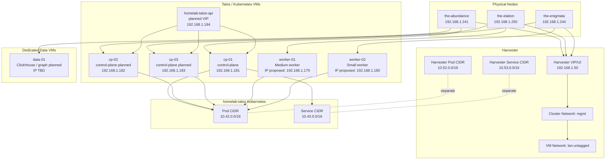

# Network Map

This file provides the current logical network map for the home lab.

## Current Physical Topology

## Harvester And Talos Logical Topology

## Current Assumptions

- The home lab is on a flat `192.168.1.0/24` LAN for now.
- No dedicated firewall/router is planned yet.
- AT&T router remains the default gateway.
- `the-abundance`, `the-elation`, and `the-enigmata` are the three verified physical Harvester nodes.
- `cp-01` is the active Talos control-plane VM on `the-abundance`.
- Old `talos-cp-01` has been retired; `192.168.1.178` should be checked before reuse.
- One worker VM per remaining physical node is planned.
- Older references to `the-remembrance` are stale unless that host is reintroduced later.
