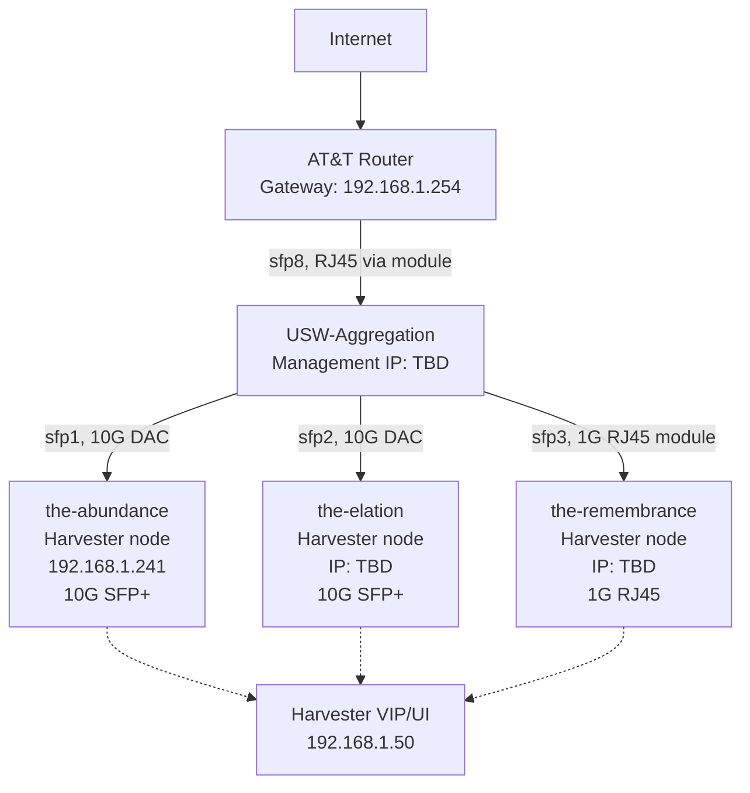
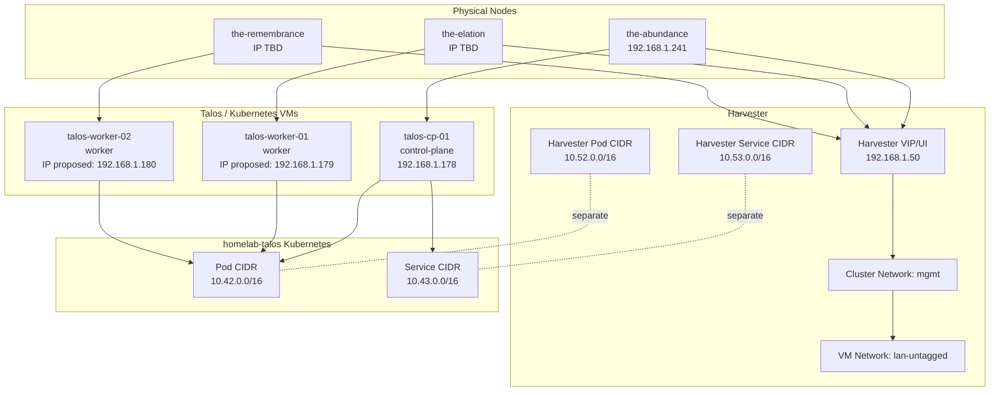

# Network Map

This file provides the current logical network map for the home lab.

## Current Physical Topology

## Harvester And Talos Logical Topology

## Current Assumptions

- The home lab is on a flat `192.168.1.0/24` LAN for now.
- No dedicated firewall/router is planned yet.
- AT&T router remains the default gateway.
- `the-abundance`, `the-elation`, and `the-remembrance` are intended to become the three physical Harvester nodes.
- The first Talos VM is active on `the-abundance`; one worker VM per remaining physical node is planned.
