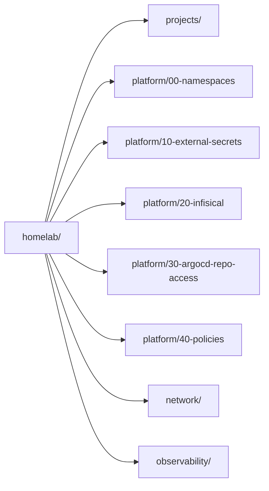

# homelab Kubernetes Cluster

This directory is the desired state for the `homelab-talos` guest Kubernetes
cluster after bootstrap.

## GitOps Entry Point

The root Argo CD Application points at `kubernetes/clusters/homelab`.

`kustomization.yaml` creates only AppProjects and child Argo CD Applications.
It does not include raw platform resources directly.



## Domains

| Directory | Purpose |
| --- | --- |
| `kustomization.yaml` | App-of-apps entry point for this cluster |
| `projects/` | Argo CD AppProject guardrails |
| `platform/` | Shared platform services and policies, organized by capability |
| `network/` | DNS, Cloudflare Tunnel, and edge exposure services |
| `observability/` | VictoriaMetrics, Grafana, exporters, and alerts |
| `apps/` | User-facing and portfolio applications |
| `sandbox/` | Experiments that may break |

## Dependency Order

Argo CD sync waves make the bootstrap order explicit:

| Wave | Component |
| --- | --- |
| `-10` | AppProjects |
| `0` | Namespaces |
| `10` | External Secrets Operator |
| `20` | Infisical ClusterSecretStore |
| `30` | Argo CD repository access ExternalSecret |
| `40` | Policies |
| `50` | Future platform services |
| `60` | Apps |
| `70` | Sandbox |

## Local Validation

Render the cluster root before pushing a GitOps change:

```bash
kubectl kustomize kubernetes/clusters/homelab
```

The root intentionally lives at `kubernetes/clusters/homelab` instead of
`kubernetes/clusters/homelab/root` so Kustomize can keep its default load
restrictions. This avoids requiring a relaxed Argo CD repo-server build option.

## Secret Management

Secret values are not stored in this repository.

The initial GitOps secret pattern is Infisical plus External Secrets Operator.
Start with a narrowly scoped `ClusterSecretStore` for platform bootstrap
secrets, then add namespace-scoped `SecretStore` objects later for app, data,
and sandbox isolation.

See `platform/20-infisical/README.md` and
`platform/30-argocd-repo-access/README.md`.

## Environment Model

This cluster does not start with separate dev/prod runtime environments. Resource constraints make a single environment more practical.

Testing and safety come from:

- local tests before Git
- CI checks before merge
- manifest validation
- policy/admission guardrails
- Argo CD diff and health checks
- sandbox namespace for risky experiments

Do not create persistent dev/prod copies of databases by default. Use seed datasets, snapshots, or dedicated single-purpose VMs when a workload needs heavier testing.
